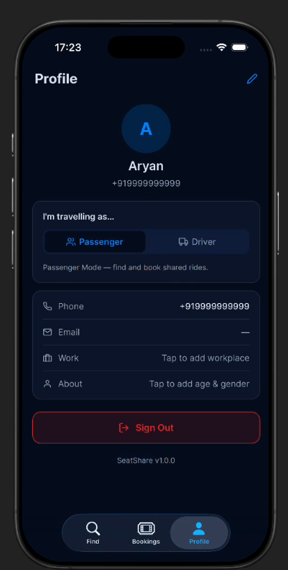

# SeatShare

SeatShare is an AI-powered ride-sharing platform that intelligently matches passengers with drivers traveling similar routes to reduce travel costs, improve vehicle utilization, and provide a seamless ride-sharing experience through real-time tracking and smart route matching.

## ✨ Features

- 🚗 Driver & Passenger modes
- 📍 Live GPS tracking
- 🗺️ Intelligent route matching
- 🔐 Secure authentication
- 📡 Real-time updates using WebSockets
- 👨‍💼 Admin dashboard
- 📱 Cross-platform mobile app (Expo React Native)

## 🛠️ Tech Stack

- TypeScript
- React Native (Expo)
- React
- Express.js
- PostgreSQL
- Drizzle ORM
- WebSockets

## 📚 Documentation

Detailed documentation is available in:

- `ARCHITECTURE.md`
- `API.md`
- `DATABASE.md`
- `PRD.md`
- `ROADMAP.md`
- `TESTING.md`

## 📱 Screenshots

| Login | Setup |
|-------|-------|
|  |  |

| Ride Request | Requests |
|-------------|----------|
|  |  |

| Profile | Profile Data |
|---------|--------------|
|  |  |

## 🚀 Status

🚧 Currently under active development.
